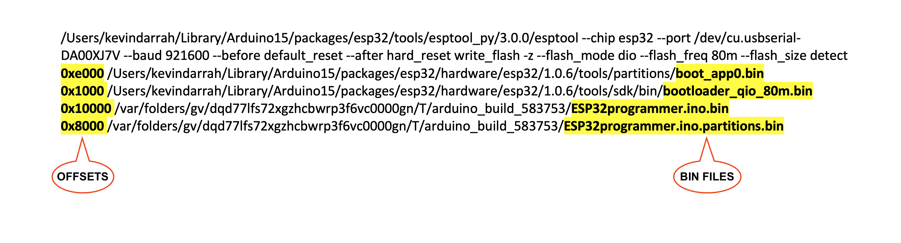

**Usage** 
============

The board ships with everything ready to go - preloaded with firmware to start flashing right away.  Even the microSD card is preloaded with bin files for trigBoard release (11/29/21)

**Board Power**
------------------
   Can just connect a micro USB cable to the board or a 4.2V lithium battery (CHECK POLARITY), any of the `adafruit batteries <https://www.adafruit.com/product/258>`_ will work.  Note that the board can also charge the battery - the charge LED indicates status red-charging, green-complete

**Target Power**
   The board has a PH-2 JST connector that can be used to power the target ESP32.  There are 4 power sources for this connector selected by jumper:

* 3.0V is a switched power source that the board can turn on/off on-demand.  Very useful for power cycling the target and since it's 3.0V, can be used for calibration.  **RECCOMENDED**
* 5V always on from USB, or boosted if running on battery
* 3.3V always on
* VBAT is the raw battery voltage

**Files**
-----------------

   When you upload from the Arduino IDE, it flashes x4 bin files.  One of these is the actual firmware, while the other 3 are mostly going to be the same for most applications.  You can use the stock files that are on the microSD card, and only replace this file: 

You can generate this file yourself by "Export Compile Binary" from the Arduino IDE:

The ESPprogrammer will automatically find all of these files by their names, so don't worry about renaming.  
   This is how it finds these files:

.. code-block:: C

   const char bootKey[] = "boot_app";
   const char bootloaderKey[] = "bootloader";
   const char partitionsKey[] = "partitions";
   const char firmwareKey[] = ".ino.bin";//when you flash over USB, it looks like this
   const char firmwareSecondKey[] = "esp32.bin";//when you export compiled binary, this is the file it generates

Those other three bin files can also be updated, since these are generated when their are updates to the ESP32 core or if any of the board settings are changed.  From the IDE, make sure Verbose output is enabled, then when you try to upload via USB (even if a board isn't connected), you want to copy this last command out: 

Paste that into text editor and you'll see the paths to all 4 bin files:

You can navigate to these folders and **COPY** them to the microSD card.  

**Connections**
--------------------

**All signals are 3.3V! regardless of target power setting**

The female 1x6 connector follows a standard FTDI pinout, where the DTR pin is controlled by the board to trigger the auto-reset circuit, but if your target board doesn't have an auto-reset circuit, then you'll have to toggle reset/gpio0 on the target to place in download mode. 

The 2x6 was intended to be used with `Tag Connect Cables <https://www.tag-connect.com/product/tc2030-idc-nl>`_

You'll notice that even the programmer board uses this style interface, so technically programmer board can upload to another programmer board!! 

For reference, the supporting pinout on the target board: 

**Flashing**
-------------------------

- Files loaded on microSD card?
- Target Power set?
- Target board connected?
- Programmer board has power?
- Slide the switch to ON, wait for GREEN LED? 
- PRESS Green Button, and should see the YELLOW LED start flashing, when you see the GREEN LED flash, then you know everything is working. Eventually, you'll see the only the GREEN LED flash, and you're done!  

NOTE: If you see the RED LED turn on, this means something went wrong and will have press the RESET button to start over. You can connect to the HOST Programming port with a USB-Serial converter to debug what went wrong.
